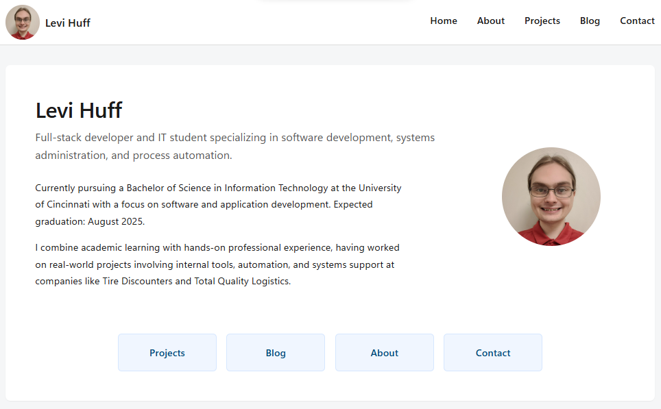
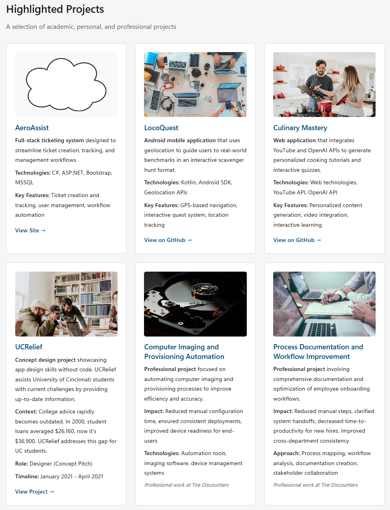
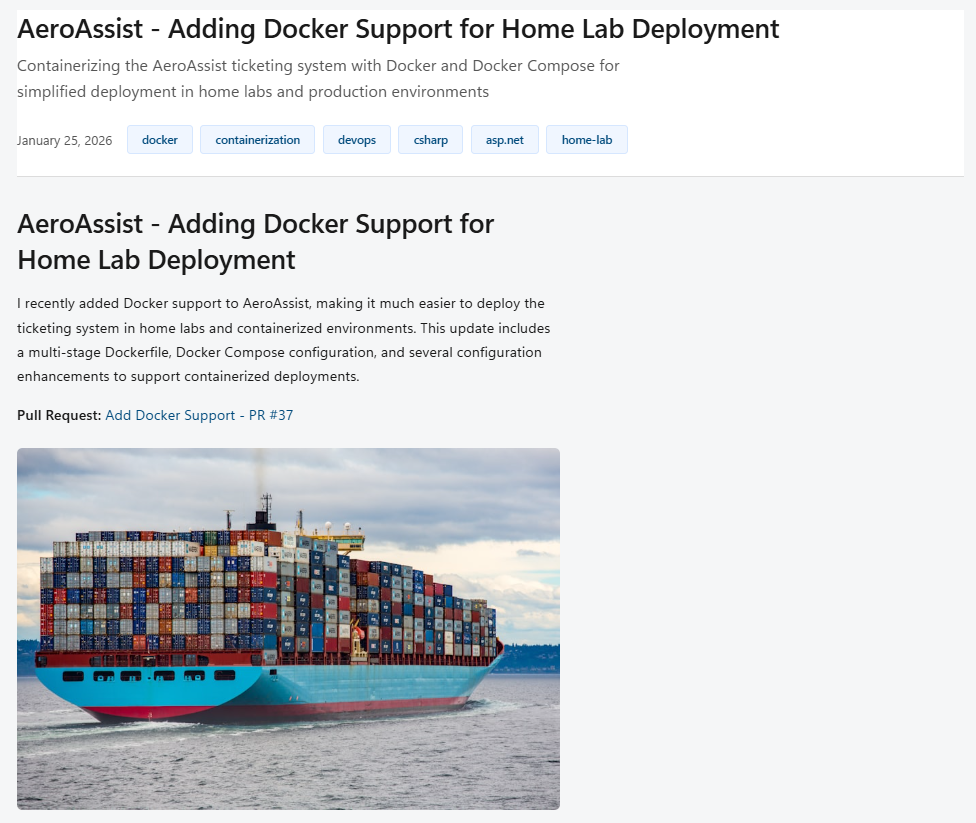

# levihuff.net

Personal portfolio website built with [Eleventy](https://www.11ty.dev/).

**Live Site:** [levihuff.net](https://levihuff.net)

## Screenshots

### Homepage


### Projects


### Blog


## Tech Stack

- **Generator:** Eleventy (11ty)
- **Templates:** Nunjucks, Markdown
- **Styling:** CSS custom properties
- **Deploy:** GitHub Actions → FTP

## Development

```bash
npm install
npm start       # Dev server
npm run build   # Production build
```

## Structure

```
src/
├── _layouts/     # Templates
├── blog/         # Posts (Markdown)
├── css/          # Styles
├── images/       # Assets
└── *.njk         # Pages
```
