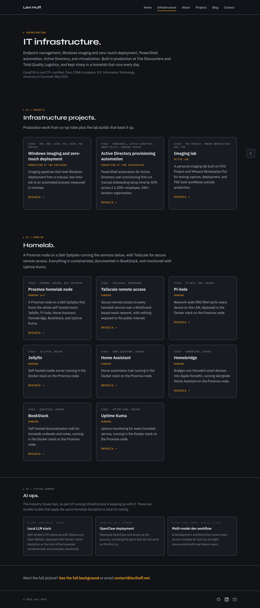

# levihuff.net

Personal portfolio website built with [Eleventy](https://www.11ty.dev/).

**Live site:** [levihuff.net](https://levihuff.net)

## Screenshots

### Homepage


### Infrastructure


### Projects


### Blog


---

## Quick start

**Requirements:** Node.js 20+ (CI runs on Node 22)

```bash
git clone <repo>
cd levihuff.net
npm install
npm start          # builds once, then serves with live reload at http://localhost:8080
```

No `.env` file or local secrets are needed for development.

---

## Tech stack

| Layer | Technology |
|---|---|
| Static site generator | Eleventy 3.x (`eleventy.config.cjs`) |
| Templates | Nunjucks, Markdown (`markdown-it` + `markdown-it-anchor`) |
| CSS | Tailwind CSS 3.x (CLI), PostCSS, autoprefixer, cssnano |
| Client-side interactivity | Vue 3 CDN islands (project filter, blog tag filter) |
| Animations | Motion One 10.x (CDN, ESM import, gated on `prefers-reduced-motion`) |
| Tests | Vitest 4.x |
| CI | GitHub Actions (tests, security scanning, deploy) |
| Deploy | FTP via `SamKirkland/FTP-Deploy-Action` |
| Hosting | Porkbun shared hosting |

---

## Repository layout

```
levihuff.net/
├── eleventy.config.cjs   # Eleventy config: plugins, filters, collections, transforms, passthroughs
├── tailwind.config.js    # Tailwind theme tokens, content globs, breakpoints
├── postcss.config.js     # autoprefixer + conditional cssnano (production only)
├── vitest.config.js      # Vitest config
├── package.json
│
├── src/
│   ├── _layouts/
│   │   ├── base.njk      # Site shell: <head>, nav, footer, dark theme bootstrap, Motion animations
│   │   └── post.njk      # Extends base; adds JSON-LD for blog posts
│   │
│   ├── _includes/
│   │   ├── components/
│   │   │   ├── nav.njk
│   │   │   ├── footer.njk
│   │   │   ├── project-card.njk
│   │   │   ├── experience-card.njk
│   │   │   ├── infra-card.njk
│   │   │   ├── skill-group.njk
│   │   │   └── landing/project-card-mini.njk
│   │   └── css/
│   │       └── tailwind.css    # CSS entry point; custom rules in @layer blocks
│   │
│   ├── _data/                  # Auto-exposed as Eleventy template globals
│   │   ├── site.json
│   │   ├── navigation.json
│   │   ├── projects.json
│   │   ├── experience.json
│   │   ├── skills.json
│   │   ├── tools.json
│   │   └── infra.js            # Infrastructure projects, homelab services, AI ops layer
│   │
│   ├── blog/                   # Markdown posts + index.njk listing (Vue tag filter)
│   ├── infrastructure/         # index.njk (hub) + entry.njk (paginated detail pages)
│   ├── tags/                   # index.njk (all tags) + tag.njk (per-tag pagination)
│   ├── images/                 # Passthrough: copied as-is to _site/images/
│   ├── fonts/                  # Passthrough: self-hosted woff2 fonts
│   ├── files/                  # Passthrough: resume PDF
│   ├── humans.txt              # Passthrough
│   ├── filters.js              # Seven Eleventy filter functions
│   │
│   ├── index.njk               # Homepage
│   ├── about.njk               # About page (includes the merged resume content)
│   ├── projects.njk            # Projects page (Vue category filter)
│   ├── resume.njk              # Redirect stub: /resume/ → /about/
│   ├── contact.njk
│   ├── feed.njk                # Atom feed
│   ├── sitemap.njk
│   ├── 404.njk
│   └── security-txt.njk
│
├── test/
│   ├── filters.test.js         # Unit tests for src/filters.js
│   ├── data.test.js            # Schema validation for src/_data/* (JSON + infra.js)
│   ├── blog.test.js            # Frontmatter validation for src/blog/*.md
│   └── build.test.js           # Full build smoke test (runs npm run build)
│
├── _site/                      # Build output: gitignored, FTP-deployed
├── docs/screenshots/           # README screenshots
│
├── .claude/                    # Agent harness: slash commands, skills, hooks (see AGENT_CONFIG.md)
├── .cursor/                    # Cursor rule + parallel review monitor agent
│
└── .github/workflows/
    ├── ci.yml                  # Run tests on PRs and non-main pushes
    ├── security.yml            # gitleaks, tracked-.env guard, npm audit (high+)
    └── deploy.yml              # Test + build + FTP deploy on push to main
```

---

## Architecture overview

This is a pure static site. There is no application server. `npm run build` transforms `src/` into plain HTML, CSS, and assets in `_site/`, which is then deployed verbatim via FTP.

Two parallel build paths:

**Template pipeline**

```
src/**/*.{njk,md}
  └─ Eleventy (eleventy.config.cjs)
       ├─ Nunjucks renderer (layouts, components, pages)
       ├─ markdown-it (blog posts, with anchor links)
       ├─ Plugins: @11ty/eleventy-plugin-rss (Atom feed), @11ty/eleventy-plugin-syntaxhighlight (Prism)
       ├─ Filters (src/filters.js)
       ├─ Transforms (img width/height injection, lazy loading + fetchpriority)
       └─ Global data (src/_data/*, currentYear, buildDate, gitHash)
            └─> _site/**/*.html
```

**CSS pipeline**

```
src/_includes/css/tailwind.css
  └─ Tailwind CLI (scans src/**/*.{njk,md,html} for class names)
       └─ PostCSS (tailwindcss, autoprefixer, cssnano[prod])
            └─> _site/css/styles.css
```

`npm start` runs a full build first (so `_site/css/styles.css` exists before the 11ty dev server starts), then watches both pipelines in parallel. The `gitHash` global (short commit hash) cache-busts the CSS URL on every deploy.

**Client-side JavaScript:**

- Inline scripts in `src/_layouts/base.njk`: dark theme bootstrap (sets `data-theme="dark"` on `<html>` before first paint), Motion One animations (hero stagger, section reveal, grid stagger; all skipped when `prefers-reduced-motion` is set), mobile hamburger nav toggle, and "back to top" button visibility.
- Two Vue 3 islands: the project category filter on `/projects/` and the blog tag filter on `/blog/`. Vue is loaded as an inline ES module import pinned to `vue@3.5.34`. The version pin is the supply-chain guard (SRI cannot be added to inline `import()` statements), so do not change it to a floating range.

The only external network dependencies at runtime are the two jsDelivr CDN loads: Motion One (`motion@10.18.0/+esm`) and Vue (`vue@3.5.34`). There are no XHR calls, no service workers, and no backend.

---

## Data flow between major components

```
src/_data/*.json + infra.js   ←──── edit here to update content
       │
       │  Eleventy exposes every _data file as a template global
       ▼
src/**/*.njk / src/blog/*.md
       │
       │  Layouts wrap pages; components are included via 
       │  Filters (src/filters.js) transform values inline
       ▼
_site/**/*.html    ←──── static output, FTP-uploaded
```

**Concrete example, the infrastructure section:**

1. `src/_data/infra.js` exports an array available as `{{ infra }}` in any template.
2. `src/infrastructure/index.njk` groups entries by `section` and renders each via ``.
3. `src/infrastructure/entry.njk` paginates over the same array, generating one detail page per entry at `/infrastructure/<slug>/`.
4. Entries with `featured: true` also surface on the homepage.

**Collections** are defined in `eleventy.config.cjs`:
- `posts`: every `src/blog/**/*.md` file, used by `src/blog/index.njk` and `src/tags/tag.njk`
- `tagList`: deduplicated, sorted array of all tags across posts, used by `src/tags/index.njk`

**Filters** (defined in `src/filters.js`, registered in `eleventy.config.cjs`):

| Filter | Input → Output |
|---|---|
| `tagSlug` | Tag string → URL-safe slug |
| `imageDimensions` | Root-relative image path → `{width, height}` or `null` if missing |
| `dateReadable` | Date → `"June 1, 2024"` |
| `dateIso` | Date → ISO 8601 string; throws on invalid dates |
| `dateYMD` | Date → `"YYYY-MM-DD"` (sitemap) |
| `safeCdata` | String → escaped for CDATA in Atom feed |
| `readingTime` | Post content → `"N min read"` at 200 wpm |

**Transforms** (also in `eleventy.config.cjs`):
- `img-dimensions` adds `width`/`height` to `` tags that lack them (via `imageDimensions`).
- `img-lazy-loading` sets `fetchpriority="high"` on the first image inside a blog post's `.post-content` and `loading="lazy"` on the rest.

---

## API endpoints and data layer

**There are no HTTP/REST API endpoints.** This is a fully static site. The only outbound network calls at runtime are the Motion One and Vue CDN loads from jsDelivr.

### Data layer (build-time data API)

All structured content lives in `src/_data/` as JSON files plus one CommonJS module (`infra.js`). Eleventy exposes each as a template global automatically; the filename (without extension) becomes the variable name. `test/data.test.js` enforces the schemas below; breaking them will fail CI.

#### `site.json`

Global site identity consumed by `base.njk` on every page.

```json
{
  "name": "string (non-empty)",
  "url": "string (must start with https://)",
  "email": "string (must contain @)",
  "graduationDate": "string",
  "social": {
    "github": "string (must start with https://github.com/)",
    "linkedin": "string (must start with https://)",
    "handshake": "string"
  }
}
```

#### `navigation.json`

Array of nav items rendered by `components/nav.njk`. URLs must be root-relative (start with `/`). No duplicate URLs allowed.

```json
[
  { "label": "string (non-empty)", "url": "/root-relative-path/" }
]
```

#### `projects.json`

Array of project objects for `projects.njk` and the homepage featured cards. All fields below are required unless noted.

```json
{
  "title": "string",
  "featured": true,
  "category": "string",
  "stack": "string",
  "summary": "string",
  "description": "string (may contain HTML)",
  "image": "string (URL or root-relative path)",
  "imageAlt": "string",
  "imageWidth": 1200,
  "imageHeight": 800,
  "imageLoading": "lazy | eager",
  "imageClass": "string | null",
  "paragraphs": [{ "label": "string", "text": "string" }],
  "link": "https://... | null",
  "linkLabel": "string (required when link is non-null)",
  "meta": "string | null"
}
```

#### `infra.js`

CommonJS module exporting an array: the single source of truth for infrastructure projects, homelab services, and the AI ops layer. Every entry renders a card via `components/infra-card.njk` and a detail page at `/infrastructure/<slug>/`.

```js
{
  slug: "kebab-case",                    // unique, /^[a-z0-9-]+$/, becomes the URL segment
  name: "string (non-empty)",
  section: "infrastructure | homelab | ai-ops",
  kind: "project | service",
  role: "string (one-line ownership statement)",
  stack: ["string", ...],                // non-empty array of non-empty strings
  status: "string",
  summary: "string (card copy)",
  details: [{ label: "string", text: "string" }],
  links: [{ label: "string", url: "/... or https://..." }],
  featured: true                         // featured entries surface on the homepage
}
```

Entry copy must not contain em dashes; `test/data.test.js` fails the suite if any appear (the same test also bans em dashes in every `.njk` template).

#### `experience.json`

Array of work history entries for `about.njk`. The three string fields are required and must be non-empty; `highlights` is an optional array of non-empty strings rendered as achievement bullets.

```json
[
  {
    "company": "string",
    "focusAreas": "string (role and date range)",
    "description": "string",
    "highlights": ["string (optional)"]
  }
]
```

#### `skills.json`

Array of skill groups for the skills section. Each group must have a non-empty heading and at least one item.

```json
[
  {
    "heading": "string",
    "items": [
      { "label": "string", "text": "string" }
    ]
  }
]
```

#### `tools.json`

Array of tool badges with uppercase category labels.

```json
[
  { "name": "string", "category": "UPPERCASE_STRING" }
]
```

---

## Environment variables

| Variable | Used by | When | Notes |
|---|---|---|---|
| `NODE_ENV=production` | `postcss.config.js` | `npm run build` | Enables cssnano minification. Set automatically by the deploy workflow. |
| `FTP_SERVER` | `deploy.yml` | CI deploy only | GitHub repository secret. Not needed locally. |
| `FTP_USERNAME` | `deploy.yml` | CI deploy only | GitHub repository secret. Not needed locally. |
| `FTP_PASSWORD` | `deploy.yml` | CI deploy only | GitHub repository secret. Not needed locally. |
| `FTP_SERVER_DIR` | `deploy.yml` | CI deploy only | GitHub repository secret. Not needed locally. |

No `.env` file is used. The local dev server requires no environment configuration. `security.yml` fails the build if a real `.env` file is ever tracked.

---

## NPM scripts

| Script | What it does |
|---|---|
| `npm start` | Full build, then watches 11ty and CSS in parallel with live reload |
| `npm run build` | One-shot production build → `_site/` (Eleventy + Tailwind `--minify`) |
| `npm run watch` | Watch both 11ty and CSS without starting a dev server |
| `npm run dev:11ty` | `eleventy --serve` only (CSS must already be built) |
| `npm run dev:css` | Tailwind watch only |
| `npm run watch:11ty` | `eleventy --watch` (no server) |
| `npm run watch:css` | Tailwind watch (same as `dev:css`) |
| `npm test` | Run the full Vitest suite once |
| `npm run test:watch` | Run Vitest in interactive watch mode |

---

## Testing

```bash
npm test           # one-shot run
npm run test:watch # interactive watch
```

Four test files under `test/`:

| File | Covers |
|---|---|
| `test/filters.test.js` | Unit tests for all seven functions in `src/filters.js` |
| `test/data.test.js` | Schema validation for all `src/_data/*.json` files and `src/_data/infra.js`; bans em dashes in infra copy and `.njk` templates |
| `test/blog.test.js` | Frontmatter validation for every `src/blog/*.md` (title, date, description, layout, tags, thumbnail existence) |
| `test/build.test.js` | Full build smoke test: verifies generated HTML/feed/sitemap, internal links, ``, OG meta tags, minified CSS, passthrough artifacts |

**`test/build.test.js` runs `npm run build` in `beforeAll` and can take up to 2 minutes.** Run it before merging if you've changed templates, data files, or the CSS pipeline.

Always run `npm test` after any change. CI runs the full suite on every push and PR.

---

## Deployment

**Push to `main`** triggers `.github/workflows/deploy.yml`:

1. Install dependencies (`npm ci`)
2. Run tests and build (`npm run test && npm run build`)
3. FTP-upload `_site/` to the configured server directory

A `concurrency` block queues concurrent `main` pushes rather than running them in parallel, preventing interleaved FTP uploads from corrupting the live host. Do not remove it.

**Push to any other branch / open a PR** triggers `.github/workflows/ci.yml`:

1. Install dependencies (`npm ci`)
2. Run tests (`npm test`)

**Every push and PR** also triggers `.github/workflows/security.yml`:

1. gitleaks secret scan over the full git history (config: `.gitleaks.toml`)
2. Guard against any real `.env` file being tracked
3. `npm audit --audit-level=high` (fails on high/critical advisories)

No manual deployment steps are required. Configure the four FTP secrets (`FTP_SERVER`, `FTP_USERNAME`, `FTP_PASSWORD`, `FTP_SERVER_DIR`) in the GitHub repository settings under **Settings → Secrets and variables → Actions**.

---

## Adding content

### Add a blog post

Create `src/blog/your-post-slug.md` with the required frontmatter:

```yaml
---
title: "Post title"
description: "One sentence summary shown in cards and meta tags."
date: 2024-06-01
tags: ["tag-one", "tag-two"]
layout: post.njk
thumbnail: /images/blog/your-image.jpg
---

Post body in Markdown.
```

All six fields are required. `test/blog.test.js` verifies them and checks that the thumbnail file exists on disk.

### Add an infrastructure or homelab entry

Append one object to `src/_data/infra.js` matching the schema in the [Data layer](#data-layer-build-time-data-api) section. That's it: the hub card, detail page, and (if `featured: true`) homepage card are all generated from the data. No template work needed. Run `npm test` to confirm schema validation passes.

### Add a project

1. Append an object to `src/_data/projects.json` matching the schema in the [Data layer](#data-layer-build-time-data-api) section.
2. Add the project image to `src/images/projects/` (or `src/images/` for a new subdirectory).
3. Run `npm test` to confirm schema validation passes.

### Add a page

1. Create `src/your-page.njk` with at minimum:
   ```yaml
   ---
   layout: base.njk
   title: "Page title"
   ---
   ```
2. If the page should appear in the nav, add an entry to `src/_data/navigation.json`:
   ```json
   { "label": "Your Page", "url": "/your-page/" }
   ```
3. If the page has internal links to other `_site/` paths, add a test assertion in `test/build.test.js` so they're verified on every build.

### Add or change a data file schema

If you add a new field to any `src/_data/` file, update the corresponding `describe` block in `test/data.test.js` to assert the new field. CI enforces the tests; unvalidated schema changes will silently go untested.

---

## Further reading

- [`CLAUDE.md`](CLAUDE.md) — Deeper architecture notes, filter documentation, template conventions, and AI assistant guidance.
- [`DESIGN.md`](DESIGN.md) — Design system: color tokens, typography scale, spacing, motion rules, and accessibility constraints. Read this before touching CSS or adding components.
- [`AGENT_CONFIG.md`](AGENT_CONFIG.md) — Index of the repo-level agent harness: slash commands, skills, hooks, and the Cursor review monitor.
- [`AGENTS.md`](AGENTS.md) — Codex-oriented contributor notes; a condensed companion to `CLAUDE.md`.
- [`PLAN.md`](PLAN.md) — Planning notes for the infrastructure hub and AI ops layer.
