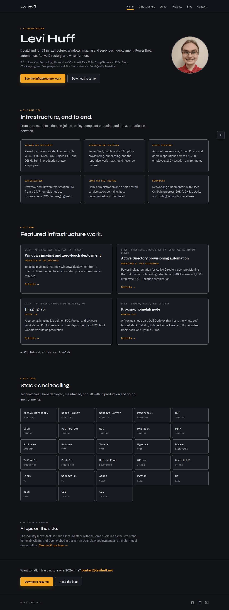
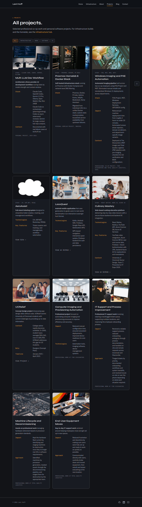
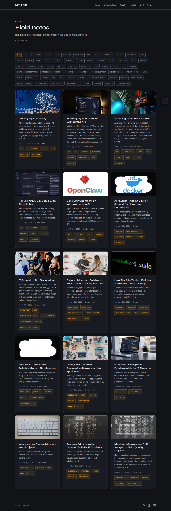

# levihuff.net

Personal portfolio website built with [Eleventy](https://www.11ty.dev/).

**Live site:** [levihuff.net](https://levihuff.net)

## Screenshots

### Homepage


### Projects


### Blog


---

## Quick start

**Requirements:** Node.js 20+

```bash
git clone <repo>
cd levihuff.net
npm install
npm start          # builds once, then serves with live reload at http://localhost:8080
```

No `.env` file or local secrets are needed for development.

---

## Tech stack

| Layer | Technology |
|---|---|
| Static site generator | Eleventy 2.x |
| Templates | Nunjucks, Markdown (`markdown-it`) |
| CSS | Tailwind CSS 3.x (CLI), PostCSS, autoprefixer, cssnano |
| Tests | Vitest 4.x |
| Animations | Motion One 10.x (CDN, ESM import) |
| CI | GitHub Actions |
| Deploy | FTP via `SamKirkland/FTP-Deploy-Action` |
| Hosting | Porkbun shared hosting |

---

## Repository layout

```
levihuff.net/
├── .eleventy.js          # Eleventy config: plugins, filters, collections, passthroughs
├── tailwind.config.js    # Tailwind theme tokens, content globs, breakpoints
├── postcss.config.js     # autoprefixer + conditional cssnano (production only)
├── vitest.config.js      # Vitest config
├── package.json
│
├── src/
│   ├── _layouts/
│   │   ├── base.njk      # Site shell: <head>, nav, footer, dark theme bootstrap, Motion animations
│   │   └── post.njk      # Extends base; adds JSON-LD for blog posts
│   │
│   ├── _includes/
│   │   ├── components/
│   │   │   ├── nav.njk
│   │   │   ├── footer.njk
│   │   │   ├── project-card.njk
│   │   │   ├── experience-card.njk
│   │   │   ├── skill-group.njk
│   │   │   └── landing/project-card-mini.njk
│   │   └── css/
│   │       └── tailwind.css    # CSS entry point; custom rules in @layer blocks
│   │
│   ├── _data/                  # JSON files auto-exposed as Eleventy globals
│   │   ├── site.json
│   │   ├── navigation.json
│   │   ├── projects.json
│   │   ├── experience.json
│   │   ├── skills.json
│   │   └── tools.json
│   │
│   ├── blog/                   # Markdown posts + index.njk listing
│   ├── tags/                   # index.njk (all tags) + tag.njk (per-tag pagination)
│   ├── images/                 # Passthrough: copied as-is to _site/images/
│   ├── files/                  # Passthrough: resume PDF
│   ├── filters.js              # Six Eleventy filter functions
│   │
│   ├── index.njk               # Homepage
│   ├── about.njk
│   ├── projects.njk
│   ├── resume.njk
│   ├── contact.njk
│   ├── feed.njk                # Atom feed
│   ├── sitemap.njk
│   ├── 404.njk
│   └── security-txt.njk
│
├── test/
│   ├── filters.test.js         # Unit tests for src/filters.js
│   ├── data.test.js            # Schema validation for src/_data/*.json
│   ├── blog.test.js            # Frontmatter validation for src/blog/*.md
│   └── build.test.js           # Full build smoke test (runs npm run build)
│
├── _site/                      # Build output — gitignored, FTP-deployed
├── docs/screenshots/           # README screenshots
│
└── .github/workflows/
    ├── ci.yml                  # Run tests on PRs and non-main pushes
    └── deploy.yml              # Test + build + FTP deploy on push to main
```

---

## Architecture overview

This is a pure static site. There is no application server. `npm run build` transforms `src/` into plain HTML, CSS, and assets in `_site/`, which is then deployed verbatim via FTP.

Two parallel build paths:

**Template pipeline**

```
src/**/*.{njk,md}
  └─ Eleventy (.eleventy.js)
       ├─ Nunjucks renderer (layouts, components, pages)
       ├─ markdown-it (blog posts, with anchor links)
       ├─ Filters (src/filters.js)
       └─ Global data (src/_data/*.json, currentYear, buildDate)
            └─> _site/**/*.html
```

**CSS pipeline**

```
src/_includes/css/tailwind.css
  └─ Tailwind CLI (scans src/**/*.{njk,md,html} for class names)
       └─ PostCSS (tailwindcss, autoprefixer, cssnano[prod])
            └─> _site/css/styles.css
```

`npm start` runs a full build first (so `_site/css/styles.css` exists before the 11ty dev server starts), then watches both pipelines in parallel.

**Client-side JavaScript** is limited to inline scripts in `src/_layouts/base.njk`:
- Dark theme bootstrap (sets `data-theme="dark"` on `<html>` before first paint)
- Motion One animations — hero stagger, section reveal, grid stagger — all gated on `prefers-reduced-motion`
- Mobile hamburger nav toggle
- "Back to top" button visibility

The only external network dependency at runtime is the Motion One CDN (`cdn.jsdelivr.net/npm/motion@10.18.0/+esm`). There are no XHR calls, no service workers, and no backend.

---

## Data flow between major components

```
src/_data/*.json   ←──── edit here to update content
       │
       │  Eleventy exposes every _data file as a template global
       ▼
src/**/*.njk / src/blog/*.md
       │
       │  Layouts wrap pages; components are included via 
       │  Filters (src/filters.js) transform values inline
       ▼
_site/**/*.html    ←──── static output, FTP-uploaded
```

**Concrete example — projects page:**

1. `src/_data/projects.json` is available as `{{ projects }}` in any template.
2. `src/projects.njk` iterates ``.
3. Each iteration includes ``, which renders a `<article>` with the project's image, title, description, and optional link.
4. The built output is `_site/projects/index.html`.

**Collections** are defined in `.eleventy.js`:
- `posts` — every `src/blog/**/*.md` file, used by `src/blog/index.njk` and `src/tags/tag.njk`
- `tagList` — deduplicated, sorted array of all tags across posts, used by `src/tags/index.njk`

**Filters** (defined in `src/filters.js`, registered in `.eleventy.js`):

| Filter | Input → Output |
|---|---|
| `tagSlug` | Tag string → URL-safe slug |
| `dateReadable` | Date → `"June 1, 2024"` |
| `dateIso` | Date → ISO 8601 string; throws on invalid dates |
| `dateYMD` | Date → `"YYYY-MM-DD"` (sitemap) |
| `safeCdata` | String → escaped for CDATA in Atom feed |
| `readingTime` | Post content → `"N min read"` at 200 wpm |

---

## API endpoints and data layer

**There are no HTTP/REST API endpoints.** This is a fully static site. The only outbound network call at runtime is loading Motion One from jsDelivr.

### Data layer (build-time data API)

All structured content is stored as JSON files in `src/_data/`. Eleventy exposes them as template globals automatically — the filename (without extension) becomes the variable name. `test/data.test.js` enforces the schemas below; breaking them will fail CI.

#### `site.json`

Global site identity consumed by `base.njk` on every page.

```json
{
  "name": "string (non-empty)",
  "url": "string (must start with https://)",
  "email": "string (must contain @)",
  "graduationDate": "string",
  "social": {
    "github": "string (must start with https://github.com/)",
    "linkedin": "string (must start with https://)",
    "handshake": "string"
  }
}
```

#### `navigation.json`

Array of nav items rendered by `components/nav.njk`. URLs must be root-relative (start with `/`). No duplicate URLs allowed.

```json
[
  { "label": "string (non-empty)", "url": "/root-relative-path/" }
]
```

#### `projects.json`

Array of project objects for `projects.njk` and the homepage featured cards. All fields below are required unless noted.

```json
{
  "title": "string",
  "description": "string (may contain HTML)",
  "image": "string (URL or root-relative path)",
  "imageAlt": "string",
  "imageWidth": 1200,
  "imageHeight": 800,
  "imageLoading": "lazy | eager",
  "imageClass": "string | null",
  "featured": true,
  "category": "string",
  "stack": "string",
  "summary": "string",
  "paragraphs": [{ "label": "string", "text": "string" }],
  "link": "https://... | null",
  "linkLabel": "string (required when link is non-null)",
  "meta": "string | null"
}
```

#### `experience.json`

Array of work history entries for `resume.njk` and `about.njk`. All three fields are required and must be non-empty strings.

```json
[
  {
    "company": "string",
    "focusAreas": "string (role and date range)",
    "description": "string"
  }
]
```

#### `skills.json`

Array of skill groups for the skills section. Each group must have a non-empty heading and at least one item.

```json
[
  {
    "heading": "string",
    "items": [
      { "label": "string", "text": "string" }
    ]
  }
]
```

#### `tools.json`

Array of tool badges with uppercase category labels.

```json
[
  { "name": "string", "category": "UPPERCASE_STRING" }
]
```

---

## Environment variables

| Variable | Used by | When | Notes |
|---|---|---|---|
| `NODE_ENV=production` | `postcss.config.js` | `npm run build` | Enables cssnano minification. Set automatically by the deploy workflow. |
| `FTP_SERVER` | `deploy.yml` | CI deploy only | GitHub repository secret. Not needed locally. |
| `FTP_USERNAME` | `deploy.yml` | CI deploy only | GitHub repository secret. Not needed locally. |
| `FTP_PASSWORD` | `deploy.yml` | CI deploy only | GitHub repository secret. Not needed locally. |
| `FTP_SERVER_DIR` | `deploy.yml` | CI deploy only | GitHub repository secret. Not needed locally. |

No `.env` file is used. The local dev server requires no environment configuration.

---

## NPM scripts

| Script | What it does |
|---|---|
| `npm start` | Full build, then watches 11ty and CSS in parallel with live reload |
| `npm run build` | One-shot production build → `_site/` (Eleventy + Tailwind `--minify`) |
| `npm run watch` | Watch both 11ty and CSS without starting a dev server |
| `npm run dev:11ty` | `eleventy --serve` only (CSS must already be built) |
| `npm run dev:css` | Tailwind watch only |
| `npm run watch:11ty` | `eleventy --watch` (no server) |
| `npm run watch:css` | Tailwind watch (same as `dev:css`) |
| `npm test` | Run the full Vitest suite once |
| `npm run test:watch` | Run Vitest in interactive watch mode |

---

## Testing

```bash
npm test           # one-shot run
npm run test:watch # interactive watch
```

Four test files under `test/`:

| File | Covers |
|---|---|
| `test/filters.test.js` | Unit tests for all six functions in `src/filters.js` |
| `test/data.test.js` | Schema validation for all `src/_data/*.json` files |
| `test/blog.test.js` | Frontmatter validation for every `src/blog/*.md` (title, date, description, layout, tags, thumbnail existence) |
| `test/build.test.js` | Full build smoke test — verifies generated HTML/feed/sitemap, internal links, ``, OG meta tags, non-empty CSS |

**`test/build.test.js` runs `npm run build` in `beforeAll` and can take up to 2 minutes.** Run it before merging if you've changed templates, data files, or the CSS pipeline.

Always run `npm test` after any change. CI runs the full suite on every push and PR.

---

## Deployment

**Push to `main`** triggers `.github/workflows/deploy.yml`:

1. Install dependencies (`npm ci`)
2. Run tests and build (`npm run test && npm run build`)
3. FTP-upload `_site/` to the configured server directory

**Push to any other branch / open a PR** triggers `.github/workflows/ci.yml`:

1. Install dependencies (`npm ci`)
2. Run tests (`npm test`)

No manual deployment steps are required. Configure the four FTP secrets (`FTP_SERVER`, `FTP_USERNAME`, `FTP_PASSWORD`, `FTP_SERVER_DIR`) in the GitHub repository settings under **Settings → Secrets and variables → Actions**.

---

## Adding content

### Add a blog post

Create `src/blog/your-post-slug.md` with the required frontmatter:

```yaml
---
title: "Post title"
description: "One sentence summary shown in cards and meta tags."
date: 2024-06-01
tags: ["tag-one", "tag-two"]
layout: post.njk
thumbnail: /images/blog/your-image.jpg
---

Post body in Markdown.
```

All six fields are required. `test/blog.test.js` verifies them and checks that the thumbnail file exists on disk.

### Add a project

1. Append an object to `src/_data/projects.json` matching the schema in the [Data layer](#data-layer-build-time-data-api) section.
2. Add the project image to `src/images/projects/` (or `src/images/` for a new subdirectory).
3. Run `npm test` to confirm schema validation passes.

### Add a page

1. Create `src/your-page.njk` with at minimum:
   ```yaml
   ---
   layout: base.njk
   title: "Page title"
   ---
   ```
2. If the page should appear in the nav, add an entry to `src/_data/navigation.json`:
   ```json
   { "label": "Your Page", "url": "/your-page/" }
   ```
3. If the page has internal links to other `_site/` paths, add a test assertion in `test/build.test.js` so they're verified on every build.

### Add or change a data file schema

If you add a new field to any `src/_data/*.json` file, update the corresponding `describe` block in `test/data.test.js` to assert the new field. CI enforces the tests — unvalidated schema changes will silently go untested.

---

## Further reading

- [`CLAUDE.md`](CLAUDE.md) — Deeper architecture notes, filter documentation, template conventions, and AI assistant guidance.
- [`DESIGN.md`](DESIGN.md) — Design system: color tokens, typography scale, spacing, motion rules, and accessibility constraints. Read this before touching CSS or adding components.
- [`AGENTS.md`](AGENTS.md) — Codex-oriented contributor notes. **Note:** contains stale claims about the absence of a test step; the Vitest suite does exist and runs in CI.
